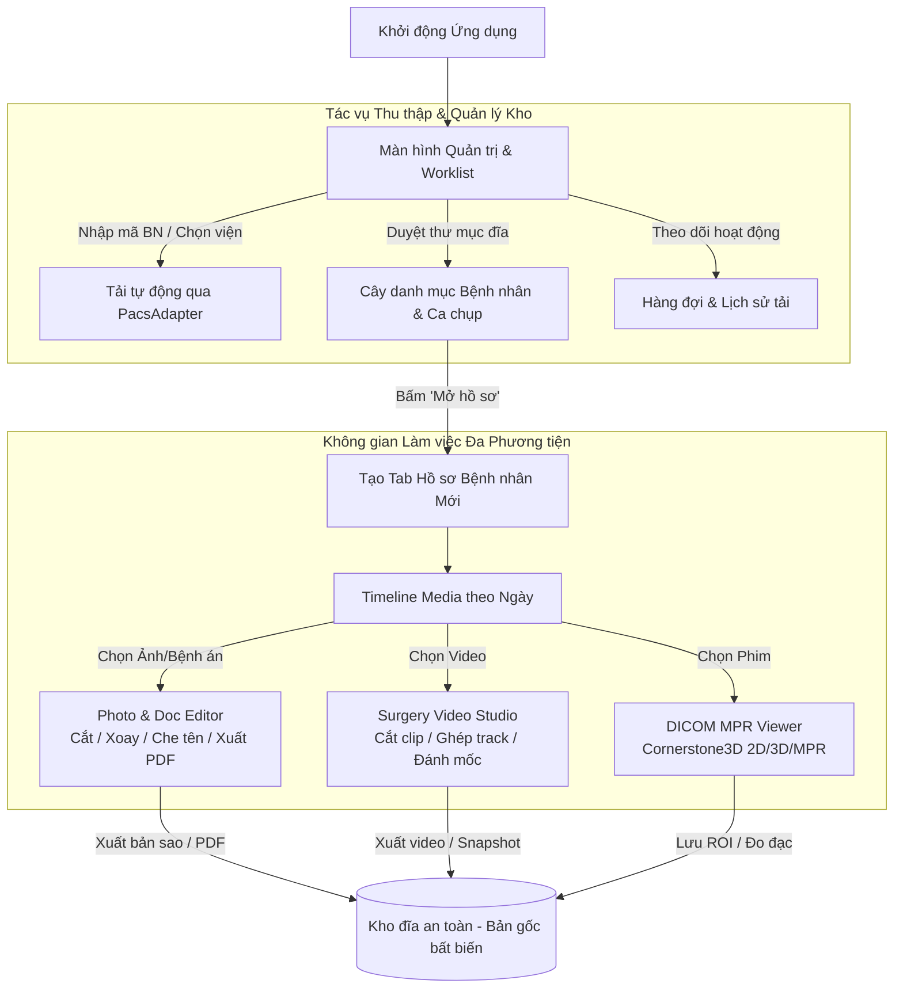

# KẾ HOẠCH & ĐÁNH GIÁ NÂNG CẤP HỆ THỐNG: DCOM TO JPG -> SUPERAPP CONCORD
**Unified Clinical Imaging & Media Workstation (Trạm làm việc Chẩn đoán Hình ảnh & Đa Phương tiện Lâm sàng)**

---

> ### Bản hiệu đính — 15/08/2026
> Bản đầu tiên được viết mà chưa đối chiếu với code thật nên sai ở nhiều chỗ trọng yếu. Bản này đã kiểm chứng từng khẳng định trên source. Sáu điểm đã sửa:
>
> | # | Điểm sai ở bản đầu | Đã sửa thành |
> | :-- | :--- | :--- |
> | 1 | "`download_all()` dùng `if/elif`", xếp PacsAdapter vào việc phải làm | **Đã triển khai xong** — 5 adapter + registry, có test khoá (mục 3.3.B) |
> | 2 | `fidelity` gồm 3 trường, có `rendered_only` | Chỉ có 2 trường; `rendered_only` **cố ý không tồn tại** (mục 3.3.B) |
> | 3 | Schema `patient-index.json`: `studies` là **list**, khoá snake_case, `status: "completed"` | `studies` là **dict keyed by studyUid**, khoá camelCase, `status: complete/selected/incomplete` (mục 3.3.C) |
> | 4 | "Đăng ký route `/api/media/*`" như một bước cấu hình | `media_api.py` là FastAPI, app không dùng FastAPI ⇒ **viết lại 390 dòng** + 4 việc bắt buộc khác (mục 3.3.A') |
> | 5 | Roadmap đặt "chạy 152 test" trước khi có FFmpeg; gộp theme chung hạng với tab đa hồ sơ | Đảo thứ tự, tách Giai đoạn 3a (rẻ) và 3b (đắt nhất dự án) — mục 4 |
> | 6 | Không nêu rủi ro `main.js` 2350 dòng state phẳng, 2 file `.patch` không apply được, CSP thiếu `media-src` | Bổ sung thành rủi ro 4, 5, 7 (mục 5) |
>
> Mọi số hiệu dòng trong tài liệu này trỏ tới code tại thời điểm hiệu đính (commit `d032567`).

---

## 1. TỔNG QUAN HIỆN TRẠNG ỨNG DỤNG HIỆN TẠI (`Dcom to JPG`)

### 1.1. Kiến trúc hiện có

| Tầng hệ thống | Tệp tin cốt lõi | Chức năng hiện tại | Đánh giá & Giới hạn khi nâng cấp |
| :--- | :--- | :--- | :--- |
| **Giao diện người dùng (Frontend WebUI)** | `webui/src/styles.css`<br>`webui/src/main.js`<br>`webui/src/viewer.js`<br>`webui/src/i18n.js` | - WebView2 / Edge Chromium.<br>- Tích hợp Cornerstone3D dựng ảnh 2D, MPR (Axial, Coronal, Sagittal), Compare 2/3, Montage 6/8, Volume 3D.<br>- Bộ công cụ đo đạc: Length, Angle, Ellipse, Freehand ROI, Window/Level, Hounsfield presets.<br>- Hỗ trợ đa ngôn ngữ VI / EN. | - **Gắn chặt (Monolithic layout):** Thanh tải phim bên trái và Viewer chính nằm chung một màn hình, chưa tách biệt màn hình quản lý (Worklist) và màn hình xem (Record/Viewer).<br>- **State phẳng toàn cục:** `main.js` là một file 2350 dòng với một object `state` duy nhất dùng chung `archive` / `mode` / `series` / `annotations` (`webui/src/main.js:80-102`). Đây là vật cản lớn nhất của toàn bộ kế hoạch — mọi hạng mục tab đa hồ sơ và viewer mới đều đâm vào nó.<br>- **Chỉ hỗ trợ 1 ca đơn lẻ:** Chưa có hệ thống tab chuyển đổi nhanh giữa các bệnh nhân.<br>- **Đơn định dạng media:** Chỉ xử lý chuỗi DICOM hoặc ảnh tĩnh JPG/PNG dạng series; chưa có trình xem/biên tập video mổ và ảnh bệnh án chuyên biệt. |
| **Máy chủ cục bộ & Quản lý phiên (Backend)** | `web_backend.py`<br>`dcom_web_app.py` | - HTTP Server cục bộ (`127.0.0.1`) trên cổng ngẫu nhiên, bảo mật bằng per-process bearer token.<br>- Đọc metadata DICOM (chuẩn single-frame và enhanced multi-frame).<br>- Chuẩn hóa pixel payload sang Grayscale / RGB.<br>- Lưu trữ và tải annotation đo đạc (`viewer-annotations.json`). | - **Single Session:** `WebController.__init__` tạo đúng một `ArchiveCatalog` và một `JobState` (`web_backend.py:1745-1746`). Mở thư mục mới sẽ ghi đè catalog cũ.<br>- **Không phải FastAPI:** server là `BaseHTTPRequestHandler` + `ThreadingHTTPServer`, định tuyến bằng chuỗi `if path == ...` thủ công (`web_backend.py:2560-2700`). Mọi route mới phải viết tay theo đúng khuôn này.<br>- **Thân request giới hạn 2MB:** `_read_json` chặn body lớn hơn 2MB và không parse multipart — không có đường upload file lớn.<br>- **Thiếu API đa phương tiện:** Chưa có endpoint chuyên dụng cho video probe/trim/concat, thumbnail filmstrip và xử lý ảnh bệnh án scan. |
| **Đường ống tải PACS (Pipeline)** | `dcom_pipeline.py`<br>`dcom_downloader_app.py` | - Tự động hóa trình duyệt qua Playwright.<br>- Hỗ trợ các phương thức truyền dữ liệu: WADO-URI, WADO-RS, metadata+frames, manifest vendor (Vrad, VRPACS).<br>- Khử trùng lặp ảnh bằng mã băm SHA-1, ghi file nguyên tử (`.part` -> rename).<br>- **Đã có** `PacsAdapter` registry (`dcom_pipeline.py:1435`) với 5 adapter: Vrad, VRPACS, DICOMweb, ZFP (GE), VietMy — chọn theo `priority` tại `dcom_pipeline.py:2063`.<br>- **Đã có** phân loại độ trung thực (`DownloadStats.original_dicom` / `reconstructed_dicom` + `fidelity_report()`, `dcom_pipeline.py:1263-1305`). | - **Chưa nhận biết loại phương tiện:** manifest chỉ mô tả study DICOM; không có khái niệm ảnh lâm sàng / bệnh án scan / video mổ.<br>- **Một job tại một thời điểm:** `WebController.job` là một `JobState` duy nhất, không tải song song nhiều bệnh nhân được. |

---

## 2. PHÂN TÍCH TÀI NGUYÊN NÂNG CẤP (`Upgrade/SuperApp- Concor`)

Thư mục nâng cấp cung cấp 3 khối giải pháp. **Mức độ sẵn sàng của từng khối rất khác nhau** — cột bên phải là điều cần đọc trước khi lập lịch:

```text
Upgrade/
├── SuperApp- Concor/
│   ├── concord-google.html         # Mockup TĨNH: dữ liệu cứng, ảnh y tế vẽ giả bằng canvas
│   ├── 01-styles.css.patch         # Token màu 3 skin (Notion, Google, Win11) + dark mặc định
│   ├── 02-main.js.patch            # Select đổi theme + applyTheme(), lưu vào localStorage
│   └── media-engine (1)/server/
│       ├── video_engine.py         # LẤY NGUYÊN ĐƯỢC — không phụ thuộc framework
│       ├── photo_engine.py         # LẤY NGUYÊN ĐƯỢC — không phụ thuộc framework
│       ├── media_api.py            # PHẢI VIẾT LẠI — là FastAPI APIRouter, app không dùng FastAPI
│       ├── dev_server.py           # Chỉ để thử engine độc lập, không dùng trong app
│       └── test_*.py               # 152 test, chạy bằng pytest và cần ffmpeg thật trên PATH
├── extention download DCOM/        # Các bản Chrome extension v2 → v7 (ngoài phạm vi kế hoạch này)
├── reference_projects/cornerstone3D/  # Mã nguồn tham chiếu Cornerstone3D
├── superapp-v3 (1).html            # Bản thiết kế MedGrid Workspace (bản trước concord-google)
└── upgrade.md                      # Đặc tả PacsAdapter — ĐÃ TRIỂN KHAI XONG, nay là tài liệu lịch sử
```

| Khối | Trạng thái thật |
| :--- | :--- |
| `upgrade.md` (PacsAdapter + fidelity) | **Đã triển khai xong** trong `dcom_pipeline.py`, có `tests/test_pacs_adapters.py` khoá lại. Không còn việc phải làm. |
| `video_engine.py` / `photo_engine.py` | Dùng được ngay, chỉ cần `Pillow` (đã có sẵn) và nhị phân FFmpeg. |
| `media_api.py` | Chỉ dùng được như **bản thiết kế route**; toàn bộ 390 dòng phải viết lại theo `BaseHTTPRequestHandler`. |
| 2 file `.patch` | **Không apply được** (đã kiểm chứng: 12/12 và 5/5 hunk FAILED). Sinh ngày 13/08 từ bản `main.js` cũ, file đã đổi ngày 15/08. Nội dung nhỏ, port tay được. |
| `concord-google.html` | Mockup tĩnh, không gọi API. Lấy được cấu trúc DOM + CSS; không lấy được logic. |

---

## 3. ĐÁNH GIÁ KHẢ NĂNG NÂNG CẤP CHI TIẾT

### 3.1. Nâng cấp Giao diện (UI & Design System)

#### A. Triết lý thiết kế: "Chrome linh hoạt — Viewport bất biến"
- **App Chrome (Thanh điều hướng, Worklist, Bảng điều khiển):** Hỗ trợ đổi Theme linh hoạt theo sở thích người dùng:
  - `Google Material`: Tông màu trắng/xám sáng, nút bấm bo góc tròn dạng thuốc (`999px`), đổ bóng mềm elevation, font Roboto.
  - `Notion Style`: Tông trắng ấm, góc bo nhỏ (`8px`), giao diện phẳng tối giản, font Inter.
  - `Windows 11 Mica`: Tông Fluent Design hiện đại, viền tinh tế.
  - `Clinical Dark`: Tông đen/xanh thẫm truyền thống của trạm đọc PACS.
- **Diagnostic Viewport (Vùng xem chẩn đoán):** **Tuyệt đối giữ nền tối (`#000000` / `#05080c`)** trong mọi Theme để đảm bảo độ chuẩn xác về thang độ sáng (Window/Level, Hounsfield Unit) và chống mỏi mắt cho bác sĩ.

> **Cần chốt trước khi code:** hai nguồn trong `Upgrade/` đang mâu thuẫn nhau. `concord-google.html` đặt `data-theme="light"` với `#themeToggle` chỉ **2 trạng thái sáng/tối**; còn `02-main.js.patch` làm `<select>` **4 skin**. Chọn bản patch (4 skin) vì nó khớp danh sách Theme ở trên.
>
> **Rủi ro thấp:** `webui/src/styles.css` hiện đã token hoá sẵn `--control-*`, `--field-*`, `--panel-bg`, `--accent-*` (`styles.css:8-37`), nên phần lớn công việc chỉ là thay nốt các mã màu hardcode còn sót.
>
> **Nhưng patch bỏ sót màu:** patch được sinh theo bản `styles.css` ngày 13/08; file nay đã 1379 dòng và phần CSS thêm sau đó chưa token hoá. Ngay trong vùng patch cũng còn sót `.status-dot { background: #27bd72 }` và `box-shadow: 0 2px 12px #0008` trên header (bóng đen đậm sẽ lộ rõ trên nền trắng của skin Google/Notion). Sau khi merge phải rà lại bằng `grep -n '#[0-9a-f]\{3,6\}' webui/src/styles.css` và duyệt từng mã màu.

#### B. Hệ thống màu sắc phân cấp rõ ràng (Color Semantics)
- **Hệ màu loại Media (Media Types):**
  - DICOM: `Xanh dương (#8ab4f8)`
  - Ảnh lâm sàng / GPB: `Xanh lá (#81c995)`
  - Bệnh án / Tài liệu scan: `Xám tím (#9aa0a6)`
  - Video phẫu thuật: `Tím hồng (#d7aefb)`
- **Hệ màu trạng thái tệp (Status Badges):**
  - Đã tải hoàn tất: `Xanh lục (#188038)`
  - Đang tải / Đang xử lý: `Xanh lam / Vàng (#1a73e8 / #fdd663)`
  - Chưa đủ lát / Thiếu file: `Cam (#b06000)`
  - Lỗi / Thiếu folder: `Đỏ (#d93025)`

#### C. Bố cục 3 tầng thống nhất
1. **Top Bar & Winbar:** Logo Concord, chuyển ngôn ngữ, đổi Theme, và thanh tab đa hồ sơ bệnh nhân (`winbar`).
2. **Worklist & Retrieval Stage:** 
   - Left Rail: Tìm kiếm mã bệnh nhân, chọn bệnh viện, tải link trực tiếp, xem log thời gian thực.
   - Main Stage: Tab `Study List` (cây danh mục Bệnh nhân -> Đợt khám -> Series) và Tab `Activity & Queue` (thống kê tổng dung lượng, số ca, tiến trình tải nền).
3. **Multi-Modal Workspace (Hồ sơ bệnh nhân):**
   - Left Rail: Thông tin hành chính, chẩn đoán tóm tắt, timeline media theo ngày.
   - Central Stage: Khung xem đa phương tiện (DICOM / Photo / Video).
   - Right Sidebar: Bảng ghi chú tọa độ & mốc thời gian liên kết tương tác.

#### D. Lấy được gì và KHÔNG lấy được gì từ `concord-google.html`

File 2474 dòng, self-contained: CSS dòng 5–1180, HTML 1182–1943, JS 1944–2474. Đây là **mockup tĩnh**: dữ liệu cứng (`TEST-0001 / NGUYỄN VĂN MẪU`), ảnh y tế vẽ giả bằng canvas (`drawMri()`, `drawDoc()`, `drawPhoto()`, `drawSurg()` + `noise()`, dòng 2370–2447). Không nhúng Cornerstone, không gọi API nào.

| ✅ Lấy được | ❌ Không lấy được |
| :--- | :--- |
| Cấu trúc DOM + CSS cho `winbar`/`wtab`, `plist`/`prow`/`srow`, `tl-item` timeline theo ngày | `show()` / `openRecord()` / `closeRecordTab()` / `embed()` — chỉ ẩn/hiện DOM bằng class `.on` |
| Hệ màu `mtag`/`badge` phân theo media type (khớp mục 3.1.B) | **Không có teardown WebGL** — đúng rủi ro 5.2 nhưng mockup không giải, phải tự viết `renderingEngine.disableElement()` |
| 3 template `tpl-dicom` / `tpl-photo` / `tpl-video` làm khung xương chung | Mọi logic dữ liệu — không có lớp nào nói chuyện với `/api/*` |
| Toolbar trong `tpl-dicom`: được ghi chú là chép nguyên từ `renderToolbarGroups()` thật, **đã đối chiếu với `main.js:239` và đúng là khớp** | Cơ chế theme (2 trạng thái) — mâu thuẫn với patch (4 skin), xem cảnh báo ở mục A |

---

### 3.2. Nâng cấp Luồng Nghiệp vụ (Flow & User Experience)



#### Các nguyên tắc luồng nghiệp vụ y khoa cốt lõi:
1. **Mô hình "Ba Viewer — Một Khung Xương":** Tất cả các viewer đều dùng chung thanh header định danh, thanh công cụ trên cùng, thanh trạng thái dưới cùng và bảng ghi chú bên phải. Nhờ đó, trải nghiệm người dùng hoàn toàn liền mạch khi chuyển đổi giữa xem phim CT/MRI sang xem video nội soi hay đọc bệnh án scan.
2. **Bản gốc bất khả xâm phạm (Non-destructive Editing):** Mọi thao tác xoay, cắt, ghi chú, che thông tin nhận dạng (De-identification/Redact) trên ảnh hoặc video đều xuất ra file bản sao mới; tệp dữ liệu y tế gốc tuyệt đối không bị ghi đè.
3. **Ghi chú gắn tọa độ không gian và thời gian:**
   - Trên phim DICOM: Gắn với lát cắt, tọa độ ROI và giá trị đo đạc (mm, HU).
   - Trên ảnh/bệnh án: Gắn với tọa độ pixel trên trang tài liệu (hộp khoanh vùng, mũi tên).
   - Trên video mổ: Gắn với mốc giây trên dòng thời gian (chapters, timestamps). Bấm vào ghi chú ở panel phải sẽ tự động tua video đến đúng mốc đó.

---

### 3.3. Nâng cấp Logic & Kiến trúc Xử lý Dữ liệu (Backend Engines)

#### A. Tích hợp Media Processing Engine (`media-engine`)
- **Video Engine (`video_engine.py`):**
  - Điều khiển FFmpeg bằng Python `subprocess`.
  - Hỗ trợ **Stream-copy trim** (cắt video siêu tốc trong ~0.15s không cần re-encode).
  - Hỗ trợ **Re-encode trim & Burn-text** (chèn chú thích chữ, che mờ thông tin màn hình máy phẫu thuật).
  - Hỗ trợ **Multi-clip Concat** (ghép các clip từ nhiều định dạng MP4, AVI, MKV, MPEG thành 1 video chuẩn hóa duy nhất).
  - Tự động nhận diện GPU tăng tốc (NVIDIA NVENC, Intel QSV) và tự động fallback về CPU (libx264).
  - Trích xuất Thumbnail và Filmstrip khung hình song song qua `ThreadPoolExecutor`.
- **Photo Engine (`photo_engine.py`):**
  - Xử lý ảnh độ phân giải cao bằng Pillow (crop, rotate, brightness/contrast).
  - Vẽ hộp chú thích, mũi tên chỉ điểm tổn thương, hộp che thông tin cá nhân (`ĐÃ CHE`).
  - Đóng gói nhiều trang bệnh án scan thành một file PDF hoàn chỉnh.
  - Cơ chế bảo vệ chống tấn công Decompression Bomb: Kiểm tra kích thước header (`width`, `height`) trước khi giải nén pixel vào RAM.
- **Hệ thống Kiểm soát Đồng thời (Concurrency Gate):**
  - Tách bạch hàng đợi tác vụ nặng (`heavy`: transcode video, concat — giới hạn theo số core CPU) và tác vụ nhẹ (`light`: probe, thumbnail, nạp ảnh).
  - Ngăn ngừa tình trạng nhiều bác sĩ xuất video cùng lúc làm cạn kiệt tài nguyên CPU của hệ thống.

##### A'. Năm việc BẮT BUỘC phải làm khi tích hợp (không phải "đăng ký route là xong")

Hai file engine bê nguyên được, nhưng `media_api.py` thì không. Đây là hạng mục bị đánh giá thấp công sức nhất của cả kế hoạch:

1. **Viết lại tầng route.** `media_api.py` là `APIRouter` của FastAPI với `@router.post`, `BaseModel`, `UploadFile`. Backend thật là `BaseHTTPRequestHandler` định tuyến bằng `if path == ...`. Không có `include_router`. Giữ lại được thiết kế đường dẫn và ánh xạ lỗi (`ServerBusyError → 429`, `*EngineError → 400`), còn lại viết tay.
2. **Không thêm dependency.** `requirements.txt` của engine đòi `fastapi`, `uvicorn`, `python-multipart`. Viết route tay thì **không cần thêm gì cả** — `pillow>=10.0` đã có sẵn trong `requirements.txt` của app. App đóng gói bằng PyInstaller, mỗi dependency thừa đều làm phình bản build.
3. **Bỏ mô hình upload.** `/api/media/upload` nhận `UploadFile` rồi ghi vào `WORK_ROOT = tempfile.gettempdir()`. Trong app này file **đã nằm sẵn trên đĩa trong kho** — không có gì để upload, và handler hiện tại cũng chặn body > 2MB nên video mổ vài GB không đi qua được. Route media phải nhận **đường dẫn tương đối trong kho**.
4. **Mở `_resolve_existing()`.** Hàm này chỉ cho phép path nằm trong `WORK_ROOT` (chính file đã ghi `TODO` về việc này). Nếu bê nguyên, **mọi route media sẽ trả 403**. Phải đổi allowed root thành `controller.output_root` + root của catalog đang mở, giữ nguyên cơ chế chặn path traversal.
5. **Nới CSP cho video.** Header hiện tại khai `img-src 'self' blob: data:` và `worker-src 'self' blob:` nhưng **không khai `media-src`** → rơi về `default-src 'self'`. Phát video qua URL same-origin thì chạy, nhưng `blob:` (cách thường dùng để preview đoạn vừa cắt) sẽ bị chặn im lặng. Thêm `media-src 'self' blob:` vào `web_backend.py:2503`.

**Về bộ 152 test:** con số là thật (19+24+20+26+12+6+34+11 = 152). Nhưng chúng chạy bằng `pytest` với fixture `tmp_path_factory`, trong khi repo này chạy `unittest` (`python -m unittest discover -t tests`). Chấp nhận hai runner song song và thêm `pytest` vào dev-deps là rẻ hơn nhiều so với port sang unittest. Quan trọng hơn: `test_video_engine.py` gọi `ffmpeg` thật từ PATH để tự sinh video mẫu — **máy hiện chưa có ffmpeg** và `tools/` chưa có thư mục `bin/`, nên cả suite sẽ fail ngay ở fixture nếu chưa làm xong việc đóng gói nhị phân.

#### B. Refactor PACS Pipeline theo Adapter Pattern — ĐÃ HOÀN THÀNH
**Hạng mục này đã triển khai xong trước khi kế hoạch được viết. Không lập lịch lại, không refactor lại.** Đặc tả gốc nằm ở `Upgrade/upgrade.md`, nay chỉ còn giá trị lịch sử.

| Thành phần | Vị trí trong code thật |
| :--- | :--- |
| `class PacsAdapter` (`observe` / `is_ready` / `download`) | `dcom_pipeline.py:1435` |
| `VradAdapter` · `VrpacsAdapter` · `DicomWebAdapter` | `dcom_pipeline.py:1484` · `1521` · `1550` |
| `ZfpAdapter` (GE Centricity) · `VietmyAdapter` — **hai adapter kế hoạch chưa từng nhắc tới** | `dcom_pipeline.py:1634` · `1667` |
| `PACS_ADAPTERS` registry | `dcom_pipeline.py:1706` |
| Chọn adapter theo `priority` (thay cho `if/elif`) | `dcom_pipeline.py:2063` |
| `DownloadStats.original_dicom` / `reconstructed_dicom` + `fidelity_report()` | `dcom_pipeline.py:1263-1305`, in ra log tại `3094` |
| Bộ test khoá hành vi | `tests/test_pacs_adapters.py` (940 dòng) |

⚠️ **Không thêm trường `rendered_only`.** Kế hoạch bản đầu chép nhầm bộ ba `original_dicom / reconstructed_dicom / rendered_only`; trường thứ ba **cố ý không tồn tại**. Comment ngay trong `DownloadStats` giải thích: *"JPG/PNG đã tự nói lên là ảnh render nên không cần đếm riêng"* — chúng được đếm qua `stats.jpg` và `stats.png`.

Việc còn lại duy nhất ở tầng pipeline: mở rộng adapter cho PACS mới khi gặp bệnh viện mới (Viettel, Fujifilm, Orthanc…) — thêm class rồi đăng ký vào `PACS_ADAPTERS`, không đụng `download_all()`.

#### C. Mở rộng Data Schema (`patient-index.json`) — CHỈ ĐƯỢC THÊM, KHÔNG ĐƯỢC ĐỔI CẤU TRÚC

🚨 **Bản kế hoạch đầu tiên vẽ sai schema này ở 3 điểm, làm theo sẽ hỏng toàn bộ kho dữ liệu đã tải.** Đối chiếu với code thật (`dcom_pipeline.py:4597` và `4686`):

| | Bản kế hoạch cũ (SAI) | Code thật |
| :--- | :--- | :--- |
| `studies` | **list** `[ {...}, {...} ]` | **dict keyed by studyUid** `{ "1.2.840...": {...} }` |
| Quy ước tên khoá | snake_case: `patient_id`, `study_uid`, `study_date`, `study_desc`, `series_count` | camelCase: `patientId`, `studyUid`, `date`, `description`, `imageCount` |
| Giá trị `status` | `"completed"` | `"complete"` / `"selected"` / `"incomplete"` |

`_read_patient_manifest()` kiểm tra thẳng `isinstance(data.get("studies"), dict)` (`dcom_pipeline.py:4333`). Đổi sang list = mọi `patient-index.json` cũ bị coi là hỏng, và `tests/test_patient_archive.py` (2728 dòng) đổ hàng loạt.

**Cách đúng — giữ nguyên khung, chỉ thêm khoá mới (có dấu `+`):**

```jsonc
{
  "format": "dcom-patient-index-v1",   // giữ nguyên, KHÔNG bump version
  "patientId": "TEST-0001",
  "patientName": "NGUYỄN VĂN MẪU",
  "patientBirthDate": "19740101",      // DICOM DA, không phải ISO
  "patientSex": "M",
  "hospitalKey": "bv-a",
  "hospitalName": "BV A",
  "createdAt": "...", "updatedAt": "...",

  "studies": {                          // DICT keyed by StudyInstanceUID
    "1.2.840.113619.2.55...": {
      "studyUid": "1.2.840.113619.2.55...",
      "date": "2026-08-06",
      "modality": "MR",
      "description": "MR sọ não có tiêm",
      "folder": "2026-08-06_MR",        // đường dẫn TƯƠNG ĐỐI so với thư mục bệnh nhân
      "status": "complete",             // complete | selected | incomplete
      "imageCount": 1412,
      "downloadedAt": "...",
      "selectedSeries": [], "downloadUrl": "", "viewerUrl": "",
      "patientCode": "TEST-0001", "accessionNumber": "",
      "downloadType": "ris", "hospitalKey": "bv-a", "hospitalName": "BV A",
      "patientAgeRaw": "", "patientAgeAtStudy": "",

      "mediaType": "dicom"              // + THÊM MỚI, mặc định "dicom" khi thiếu
    },

    "media_photo_20260806_01": {        // media không có StudyUID thật → tự sinh khoá
      "studyUid": "media_photo_20260806_01",
      "date": "2026-08-06",
      "modality": "OT",                 // DICOM modality hợp lệ cho "khác", KHÔNG dùng "Photo"
      "description": "Ảnh đối chiếu lâm sàng",
      "folder": "2026-08-06_Anh", "status": "complete", "imageCount": 4,
      "mediaType": "photo"              // + dicom | photo | doc | video
    },

    "media_video_20260805_01": {
      "studyUid": "media_video_20260805_01",
      "date": "2026-08-05", "modality": "OT",
      "description": "Mổ nội soi ổ bụng",
      "folder": "2026-08-05_Mo", "status": "complete", "imageCount": 2,
      "mediaType": "video",
      "durationSeconds": 2892            // + số giây, KHÔNG phải chuỗi "48:12" — UI tự format
    }
  }
}
```

**Nguyên tắc tương thích ngược:** bản ghi cũ không có `mediaType` phải được đọc như `"dicom"`. Không bump `PATIENT_MANIFEST_FORMAT` — thêm khoá tuỳ chọn không phải là đổi format, và bump sẽ làm `_read_patient_manifest()` từ chối mọi file cũ.

---

## 4. LỘ TRÌNH TRIỂN KHAI THEO GIAI ĐOẠN (ROADMAP)

Roadmap bản đầu có 3 chỗ sai thứ tự: xếp việc đã xong vào Giai đoạn 1, đặt "chạy 152 test" **trước** khi có FFmpeg, và gộp "đổi theme" (rẻ) chung hạng với "tab đa hồ sơ" (đắt nhất dự án). Bản dưới đã sắp lại theo phụ thuộc thật.

```text
┌──────────────────────────────────────────────────────────────────────────────────┐
│ GIAI ĐOẠN 0: Việc đã xong — KHÔNG lập lịch lại                                   │
│ ├─ ✅ PacsAdapter Registry (5 adapter, có test khoá)                              │
│ └─ ✅ DownloadStats.original_dicom / reconstructed_dicom + fidelity_report()      │
└────────────────────────────────────────┬─────────────────────────────────────────┘
                                         │
┌────────────────────────────────────────▼─────────────────────────────────────────┐
│ GIAI ĐOẠN 1: Lõi Backend đa phiên & đa phương tiện                               │
│ ├─ 1. ViewerSessionRegistry: tách ArchiveCatalog + JobState theo session id       │
│ │     (mọi endpoint /api/series/* phải mang session id) — web_backend.py:1745     │
│ └─ 2. THÊM khoá mediaType/durationSeconds vào studies dict (giữ nguyên cấu trúc,  │
│       không bump format, thiếu mediaType ⇒ đọc là "dicom")                        │
└────────────────────────────────────────┬─────────────────────────────────────────┘
                                         │
┌────────────────────────────────────────▼─────────────────────────────────────────┐
│ GIAI ĐOẠN 2: Media Engine — thứ tự đã đảo lại cho đúng phụ thuộc                 │
│ ├─ 1. Đóng gói ffmpeg.exe + ffprobe.exe vào tools/bin/ và nối configure_binaries()│
│ ├─ 2. Chạy 152 test pytest ⇒ xác nhận engine sống trên Windows (cần xong bước 1)  │
│ ├─ 3. Copy video_engine.py + photo_engine.py vào repo (không sửa nội dung)        │
│ └─ 4. VIẾT LẠI tầng route /api/media/* theo BaseHTTPRequestHandler:               │
│       • không dùng FastAPI, không thêm dependency                                 │
│       • nhận đường dẫn trong kho, bỏ hoàn toàn /upload                            │
│       • _resolve_existing() ⇒ output_root, nếu không mọi route trả 403            │
│       • thêm media-src 'self' blob: vào CSP                                       │
└────────────────────────────────────────┬─────────────────────────────────────────┘
                                         │
┌────────────────────────────────────────▼─────────────────────────────────────────┐
│ GIAI ĐOẠN 3a: Theme Skin  ⟵ RẺ, ĐỘC LẬP, LÀM SỚM ĐỂ CÓ KẾT QUẢ NHÌN THẤY NGAY   │
│ ├─ 1. Port TAY 2 file .patch (không apply được bằng patch tool)                   │
│ └─ 2. Rà hết mã màu hardcode còn sót trong styles.css (1379 dòng)                 │
└────────────────────────────────────────┬─────────────────────────────────────────┘
                                         │  (3a không chặn 3b — chạy song song được)
┌────────────────────────────────────────▼─────────────────────────────────────────┐
│ GIAI ĐOẠN 3b: Winbar & Tab đa hồ sơ  ⟵ HẠNG MỤC LỚN NHẤT, phụ thuộc GĐ1.1        │
│ ├─ 1. Tách state phẳng toàn cục trong main.js thành state-per-tab (việc chính)    │
│ ├─ 2. Winbar điều hướng (Worklist cố định + tab bệnh nhân)                        │
│ ├─ 3. Worklist 2 tab: Study List (cây) & Activity/Queue                           │
│ ├─ 4. Left Rail tải PACS đồng bộ giao diện mới                                    │
│ └─ 5. Gọi renderingEngine.disableElement() khi rời tab (mockup KHÔNG có sẵn)      │
└────────────────────────────────────────┬─────────────────────────────────────────┘
                                         │
┌────────────────────────────────────────▼─────────────────────────────────────────┐
│ GIAI ĐOẠN 4: Photo Editor & Surgery Video Studio                                 │
│ ├─ 1. Photo/Document Viewer (chú thích, che định danh, xuất PDF)                 │
│ ├─ 2. Surgery Video Studio (scrubber, chapters, multi-clip)                       │
│ ├─ 3. Đưa DICOM MPR Viewport sẵn có vào khung xương chung                         │
│ └─ 4. Test tích hợp E2E và đóng gói PyInstaller                                   │
└──────────────────────────────────────────────────────────────────────────────────┘
```

---

## 5. ĐÁNH GIÁ RỦI RO & PHƯƠNG ÁN GIẢI QUYẾT

1. **Vấn đề phân phối FFmpeg trên máy trạm Windows:**
   - *Rủi ro:* Máy tính tại bệnh viện thường không cài sẵn FFmpeg trên PATH hệ thống. **Và ngay máy phát triển hiện tại cũng chưa có** (`which ffmpeg` không tìm thấy, `tools/` chưa có thư mục `bin/`) — nên đây là việc chặn cả khâu chạy test, không chỉ khâu phát hành.
   - *Giải pháp:* Đóng gói sẵn file thực thi tĩnh `ffmpeg.exe` và `ffprobe.exe` (bản build gọn) đặt trong thư mục `tools/bin/` của ứng dụng. Hàm `configure_binaries()` trong `video_engine.py` sẽ tự động ưu tiên nhận diện thư mục này trước khi tìm trên PATH.
2. **Vấn đề quản lý bộ nhớ WebGL khi mở nhiều Tab bệnh nhân:**
   - *Rủi ro:* Mở đồng thời nhiều tab DICOM 3D/MPR có thể gây tràn VRAM GPU hoặc rò rỉ bộ nhớ WebGL.
   - *Giải pháp:* Khi người dùng chuyển sang tab khác hoặc đóng tab, tự động gọi `renderingEngine.disableElement()` hoặc tạm ngưng render để giải phóng tài nguyên.
3. **Tính tương thích ngược với dữ liệu cũ:**
   - *Rủi ro:* Các ca chụp đã tải trước đây thiếu metadata mở rộng.
   - *Giải pháp:* Trình quét `ArchiveCatalog` tự động phân tích cấu trúc thư mục hiện có; nếu phát hiện thư mục DICOM cũ, nó sẽ tự sinh bản ghi tương thích mà không làm hỏng dữ liệu đã có trên đĩa. Ở tầng manifest: thiếu `mediaType` ⇒ đọc mặc định là `"dicom"`, và **không bump** `PATIENT_MANIFEST_FORMAT`.

4. **`main.js` là file 2350 dòng với state phẳng toàn cục — rủi ro lớn nhất chưa được nêu ở bản kế hoạch đầu:**
   - *Rủi ro:* Mọi hạng mục của Giai đoạn 3b và Giai đoạn 4 đều phải sửa vào cùng một object `state` dùng chung. Nếu thêm Photo Editor và Video Studio trước khi tách state, file này sẽ vượt 5000 dòng và mỗi thay đổi sau đó đều có nguy cơ phá viewer DICOM đang chạy tốt.
   - *Giải pháp:* Tách state-per-tab **trước** (Giai đoạn 3b mục 1), coi đó là hạng mục riêng có giá trị độc lập, không nhét chung vào việc dựng winbar.

5. **Hai file `.patch` không còn apply được:**
   - *Rủi ro:* Lập lịch theo giả định "chạy `patch` là xong" sẽ hụt. Đã kiểm chứng: 12/12 hunk của `01-styles.css.patch` và 5/5 hunk của `02-main.js.patch` đều FAILED, kể cả sau khi chuẩn hoá CRLF→LF. Patch sinh ngày 13/08 từ bản `main.js` cũ; đúng khối `state` mà hunk #1 nhắm tới nay đã có thêm `showFileInfoModal`, `fileInfoData`, `fileInfoTagFilter`.
   - *Giải pháp:* Port tay. Nội dung thực tế rất nhỏ — 4 dòng override token ở `:root`, 3 khối `[data-theme]`, 1 `<select>` trong header và hàm `applyTheme()` 4 dòng.

6. **Xung đột test runner giữa engine và repo:**
   - *Rủi ro:* 152 test của media engine chạy bằng `pytest` (fixture `tmp_path_factory`), repo chạy `unittest` (`python -m unittest discover -t tests`). Port sang unittest sẽ mất fixture và tốn công vô ích.
   - *Giải pháp:* Chấp nhận hai runner song song, thêm `pytest` vào dev-deps và ghi rõ trong `HUONG_DAN.md` rằng bộ media chạy bằng lệnh riêng.

7. **CSP chặn video preview một cách im lặng:**
   - *Rủi ro:* Header hiện tại không khai `media-src`, rơi về `default-src 'self'`. Video phát bằng `blob:` sẽ không chạy và **không báo lỗi rõ ràng** — rất tốn thời gian dò.
   - *Giải pháp:* Thêm `media-src 'self' blob:` ngay khi bắt đầu Giai đoạn 2 mục 4, đừng để đến lúc dựng UI mới phát hiện.

---

## 6. KẾT LUẬN

Hướng đi của kế hoạch là đúng, nhưng phải đọc `Upgrade/SuperApp- Concor` với đúng mức độ sẵn sàng của từng khối, không coi cả thư mục là "code chạy được, chỉ việc ráp vào":

- **`video_engine.py` / `photo_engine.py` — chất lượng thật.** Concurrency gate tách `heavy`/`light`, chặn decompression bomb (`_MAX_DIMENSION = 8000`), `configure_binaries()` ưu tiên thư mục cục bộ, 152 test có thật. Bê nguyên được.
- **`media_api.py` — chỉ là bản thiết kế.** Viết cho FastAPI trong khi app dùng `BaseHTTPRequestHandler`; cộng thêm mô hình upload sai bối cảnh và `_resolve_existing()` sẽ chặn 403 mọi thứ. Toàn bộ 390 dòng phải viết lại.
- **`concord-google.html` — mockup tĩnh.** Giá trị nằm ở cấu trúc DOM và hệ màu, không ở logic.
- **`upgrade.md` — đã triển khai xong.** Là tài liệu lịch sử, không phải việc tồn.

Chi phí thật của kế hoạch **không nằm ở việc ráp media engine**, mà nằm ở hai chỗ: tách `ArchiveCatalog`/`JobState` thành đa phiên ở backend, và tách state phẳng toàn cục của `main.js` thành state-per-tab ở frontend. Làm xong hai việc đó thì Photo Editor, Video Studio và tab đa hồ sơ mới là công việc lắp ráp bình thường; làm ngược lại thì mỗi tính năng mới đều là một lần sửa vào file 2350 dòng đang gánh cả viewer DICOM đang chạy tốt.

Khi hoàn tất, `Dcom to JPG` trở thành một **Trạm làm việc Chẩn đoán Hình ảnh & Dữ liệu Lâm sàng Đa Phương tiện**, phục vụ chẩn đoán, hội chẩn, lưu trữ hồ sơ và báo cáo khoa học.
