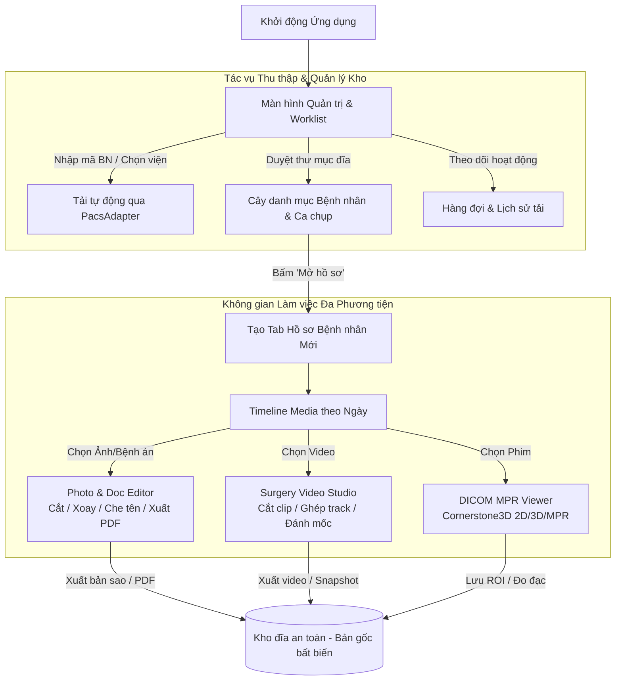

# KẾ HOẠCH & ĐÁNH GIÁ NÂNG CẤP HỆ THỐNG: DCOM TO JPG -> SUPERAPP CONCORD
**Unified Clinical Imaging & Media Workstation (Trạm làm việc Chẩn đoán Hình ảnh & Đa Phương tiện Lâm sàng)**

---

## 1. TỔNG QUAN HIỆN TRẠNG ỨNG DỤNG HIỆN TẠI (`Dcom to JPG`)

### 1.1. Kiến trúc hiện có

| Tầng hệ thống | Tệp tin cốt lõi | Chức năng hiện tại | Đánh giá & Giới hạn khi nâng cấp |
| :--- | :--- | :--- | :--- |
| **Giao diện người dùng (Frontend WebUI)** | `webui/src/styles.css`<br>`webui/src/main.js`<br>`webui/src/viewer.js`<br>`webui/src/i18n.js` | - WebView2 / Edge Chromium.<br>- Tích hợp Cornerstone3D dựng ảnh 2D, MPR (Axial, Coronal, Sagittal), Compare 2/3, Montage 6/8, Volume 3D.<br>- Bộ công cụ đo đạc: Length, Angle, Ellipse, Freehand ROI, Window/Level, Hounsfield presets.<br>- Hỗ trợ đa ngôn ngữ VI / EN. | - **Gắn chặt (Monolithic layout):** Thanh tải phim bên trái và Viewer chính nằm chung một màn hình, chưa tách biệt màn hình quản lý (Worklist) và màn hình xem (Record/Viewer).<br>- **Chỉ hỗ trợ 1 ca đơn lẻ:** Chưa có hệ thống tab chuyển đổi nhanh giữa các bệnh nhân.<br>- **Đơn định dạng media:** Chỉ xử lý chuỗi DICOM hoặc ảnh tĩnh JPG/PNG dạng series; chưa có trình xem/biên tập video mổ và ảnh bệnh án chuyên biệt. |
| **Máy chủ cục bộ & Quản lý phiên (Backend)** | `web_backend.py`<br>`dcom_web_app.py` | - HTTP Server cục bộ (`127.0.0.1`) trên cổng ngẫu nhiên, bảo mật bằng per-process bearer token.<br>- Đọc metadata DICOM (chuẩn single-frame và enhanced multi-frame).<br>- Chuẩn hóa pixel payload sang Grayscale / RGB.<br>- Lưu trữ và tải annotation đo đạc (`viewer-annotations.json`). | - **Single Session:** Backend hiện chỉ quản lý duy nhất một đối tượng `ArchiveCatalog` tại một thời điểm. Mở thư mục mới sẽ ghi đè catalog cũ.<br>- **Thiếu API đa phương tiện:** Chưa có endpoint chuyên dụng cho video probe/trim/concat, thumbnail filmstrip và xử lý ảnh bệnh án scan. |
| **Đường ống tải PACS (Pipeline)** | `dcom_pipeline.py`<br>`dcom_downloader_app.py` | - Tự động hóa trình duyệt qua Playwright.<br>- Hỗ trợ các phương thức truyền dữ liệu: WADO-URI, WADO-RS, metadata+frames, manifest vendor (Vrad, VRPACS).<br>- Khử trùng lặp ảnh bằng mã băm SHA-1, ghi file nguyên tử (`.part` -> rename). | - **Phát hiện cứng (Hardcoded detection):** `download_all()` dùng khối `if/elif` trực tiếp để chọn loại PACS.<br>- **Chưa phân loại chất lượng tải:** Chưa tách bạch rõ ràng giữa DICOM gốc (`original`), DICOM dựng từ frame (`reconstructed`) và ảnh render JPG (`rendered_only`). |

---

## 2. PHÂN TÍCH TÀI NGUYÊN NÂNG CẤP (`Upgrade/SuperApp- Concor`)

Thư mục nâng cấp cung cấp trọn vẹn 3 khối giải pháp đã qua nghiên cứu và kiểm thử thực tế:

```text
Upgrade/
├── SuperApp- Concor/
│   ├── concord-google.html         # Mockup giao diện hoàn chỉnh (Google Material Theme)
│   ├── 01-styles.css.patch         # Bản vá hệ thống Token màu đa giao diện (Notion, Google, Win11, Dark)
│   ├── 02-main.js.patch            # Logic chuyển đổi Theme động & lưu trạng thái người dùng
│   └── media-engine (1)/           # Engine xử lý Video & Ảnh đã kiểm thử 152 bài test (94% coverage)
│       └── server/
│           ├── video_engine.py     # Lõi xử lý video qua FFmpeg (stream-copy, re-encode, concat, trim)
│           ├── photo_engine.py     # Lõi xử lý ảnh qua Pillow (crop, rotate, redact, annotate, export PDF)
│           ├── media_api.py        # Tầng API REST cho video và ảnh
│           └── dev_server.py       # Máy chủ kiểm thử độc lập
├── superapp-v3 (1).html            # Bản thiết kế chi tiết MedGrid Workspace
└── upgrade.md                      # Đặc tả kiến trúc PacsAdapter & phân loại độ trung thực ảnh
```

---

## 3. ĐÁNH GIÁ KHẢ NĂNG NÂNG CẤP CHI TIẾT

### 3.1. Nâng cấp Giao diện (UI & Design System)

#### A. Triết lý thiết kế: "Chrome linh hoạt — Viewport bất biến"
- **App Chrome (Thanh điều hướng, Worklist, Bảng điều khiển):** Hỗ trợ đổi Theme linh hoạt theo sở thích người dùng:
  - `Google Material`: Tông màu trắng/xám sáng, nút bấm bo góc tròn dạng thuốc (`999px`), đổ bóng mềm elevation, font Roboto.
  - `Notion Style`: Tông trắng ấm, góc bo nhỏ (`8px`), giao diện phẳng tối giản, font Inter.
  - `Windows 11 Mica`: Tông Fluent Design hiện đại, viền tinh tế.
  - `Clinical Dark`: Tông đen/xanh thẫm truyền thống của trạm đọc PACS.
- **Diagnostic Viewport (Vùng xem chẩn đoán):** **Tuyệt đối giữ nền tối (`#000000` / `#05080c`)** trong mọi Theme để đảm bảo độ chuẩn xác về thang độ sáng (Window/Level, Hounsfield Unit) và chống mỏi mắt cho bác sĩ.

#### B. Hệ thống màu sắc phân cấp rõ ràng (Color Semantics)
- **Hệ màu loại Media (Media Types):**
  - DICOM: `Xanh dương (#8ab4f8)`
  - Ảnh lâm sàng / GPB: `Xanh lá (#81c995)`
  - Bệnh án / Tài liệu scan: `Xám tím (#9aa0a6)`
  - Video phẫu thuật: `Tím hồng (#d7aefb)`
- **Hệ màu trạng thái tệp (Status Badges):**
  - Đã tải hoàn tất: `Xanh lục (#188038)`
  - Đang tải / Đang xử lý: `Xanh lam / Vàng (#1a73e8 / #fdd663)`
  - Chưa đủ lát / Thiếu file: `Cam (#b06000)`
  - Lỗi / Thiếu folder: `Đỏ (#d93025)`

#### C. Bố cục 3 tầng thống nhất
1. **Top Bar & Winbar:** Logo Concord, chuyển ngôn ngữ, đổi Theme, và thanh tab đa hồ sơ bệnh nhân (`winbar`).
2. **Worklist & Retrieval Stage:** 
   - Left Rail: Tìm kiếm mã bệnh nhân, chọn bệnh viện, tải link trực tiếp, xem log thời gian thực.
   - Main Stage: Tab `Study List` (cây danh mục Bệnh nhân -> Đợt khám -> Series) và Tab `Activity & Queue` (thống kê tổng dung lượng, số ca, tiến trình tải nền).
3. **Multi-Modal Workspace (Hồ sơ bệnh nhân):**
   - Left Rail: Thông tin hành chính, chẩn đoán tóm tắt, timeline media theo ngày.
   - Central Stage: Khung xem đa phương tiện (DICOM / Photo / Video).
   - Right Sidebar: Bảng ghi chú tọa độ & mốc thời gian liên kết tương tác.

---

### 3.2. Nâng cấp Luồng Nghiệp vụ (Flow & User Experience)



#### Các nguyên tắc luồng nghiệp vụ y khoa cốt lõi:
1. **Mô hình "Ba Viewer — Một Khung Xương":** Tất cả các viewer đều dùng chung thanh header định danh, thanh công cụ trên cùng, thanh trạng thái dưới cùng và bảng ghi chú bên phải. Nhờ đó, trải nghiệm người dùng hoàn toàn liền mạch khi chuyển đổi giữa xem phim CT/MRI sang xem video nội soi hay đọc bệnh án scan.
2. **Bản gốc bất khả xâm phạm (Non-destructive Editing):** Mọi thao tác xoay, cắt, ghi chú, che thông tin nhận dạng (De-identification/Redact) trên ảnh hoặc video đều xuất ra file bản sao mới; tệp dữ liệu y tế gốc tuyệt đối không bị ghi đè.
3. **Ghi chú gắn tọa độ không gian và thời gian:**
   - Trên phim DICOM: Gắn với lát cắt, tọa độ ROI và giá trị đo đạc (mm, HU).
   - Trên ảnh/bệnh án: Gắn với tọa độ pixel trên trang tài liệu (hộp khoanh vùng, mũi tên).
   - Trên video mổ: Gắn với mốc giây trên dòng thời gian (chapters, timestamps). Bấm vào ghi chú ở panel phải sẽ tự động tua video đến đúng mốc đó.

---

### 3.3. Nâng cấp Logic & Kiến trúc Xử lý Dữ liệu (Backend Engines)

#### A. Tích hợp Media Processing Engine (`media-engine`)
- **Video Engine (`video_engine.py`):**
  - Điều khiển FFmpeg bằng Python `subprocess`.
  - Hỗ trợ **Stream-copy trim** (cắt video siêu tốc trong ~0.15s không cần re-encode).
  - Hỗ trợ **Re-encode trim & Burn-text** (chèn chú thích chữ, che mờ thông tin màn hình máy phẫu thuật).
  - Hỗ trợ **Multi-clip Concat** (ghép các clip từ nhiều định dạng MP4, AVI, MKV, MPEG thành 1 video chuẩn hóa duy nhất).
  - Tự động nhận diện GPU tăng tốc (NVIDIA NVENC, Intel QSV) và tự động fallback về CPU (libx264).
  - Trích xuất Thumbnail và Filmstrip khung hình song song qua `ThreadPoolExecutor`.
- **Photo Engine (`photo_engine.py`):**
  - Xử lý ảnh độ phân giải cao bằng Pillow (crop, rotate, brightness/contrast).
  - Vẽ hộp chú thích, mũi tên chỉ điểm tổn thương, hộp che thông tin cá nhân (`ĐÃ CHE`).
  - Đóng gói nhiều trang bệnh án scan thành một file PDF hoàn chỉnh.
  - Cơ chế bảo vệ chống tấn công Decompression Bomb: Kiểm tra kích thước header (`width`, `height`) trước khi giải nén pixel vào RAM.
- **Hệ thống Kiểm soát Đồng thời (Concurrency Gate):**
  - Tách bạch hàng đợi tác vụ nặng (`heavy`: transcode video, concat — giới hạn theo số core CPU) và tác vụ nhẹ (`light`: probe, thumbnail, nạp ảnh).
  - Ngăn ngừa tình trạng nhiều bác sĩ xuất video cùng lúc làm cạn kiệt tài nguyên CPU của hệ thống.

#### B. Refactor PACS Pipeline theo Adapter Pattern
- Thay thế chuỗi `if/elif` trong `dcom_pipeline.py` bằng hệ thống Adapter hướng đối tượng:
```python
class PacsAdapter:
    name: str = "generic"
    priority: int = 0
    def observe(self, response, cap: ViewerCapture) -> bool: ...
    def is_ready(self, cap: ViewerCapture) -> bool: ...
    def download(self, cap: ViewerCapture, save_body, stats, log, stop, selected_series) -> None: ...
```
- Đăng ký tự động qua `PACS_ADAPTERS`: `VradAdapter`, `VrpacsAdapter`, `DicomWebAdapter` (dễ dàng mở rộng cho Viettel PACS, Fujifilm, Orthanc).
- Bổ sung trường `fidelity` vào thống kê tải (`original_dicom`, `reconstructed_dicom`, `rendered_only`).

#### C. Mở rộng Data Schema (`patient-index.json`)
- Cấu trúc chỉ mục được nâng cấp để hỗ trợ đa phương tiện trong cùng một bệnh nhân:
```json
{
  "patient_id": "TEST-0001",
  "patient_name": "NGUYỄN VĂN MẪU",
  "gender": "M",
  "birth_date": "1974-01-01",
  "hospital": "BV A",
  "studies": [
    {
      "study_uid": "1.2.840.113619.2.55...",
      "study_date": "2026-08-06",
      "study_desc": "MR sọ não có tiêm",
      "modality": "MR",
      "media_type": "dicom",
      "series_count": 12,
      "slice_count": 1412,
      "status": "completed"
    },
    {
      "study_uid": "media_photo_20260806_01",
      "study_date": "2026-08-06",
      "study_desc": "Ảnh đối chiếu lâm sàng",
      "modality": "Photo",
      "media_type": "photo",
      "item_count": 4,
      "status": "completed"
    },
    {
      "study_uid": "media_video_20260805_01",
      "study_date": "2026-08-05",
      "study_desc": "Mổ nội soi ổ bụng",
      "modality": "Video",
      "media_type": "video",
      "duration": "48:12",
      "clip_count": 2,
      "status": "completed"
    }
  ]
}
```

---

## 4. LỘ TRÌNH TRIỂN KHAI THEO GIAI ĐOẠN (ROADMAP)

```text
┌──────────────────────────────────────────────────────────────────────────────────┐
│ GIAI ĐOẠN 1: Chuẩn hóa Lõi Backend & Đường ống PACS (Backend Core Refactoring)  │
│ ├─ 1. Áp dụng PacsAdapter Registry trong dcom_pipeline.py                        │
│ ├─ 2. Bổ sung trường thống kê độ trung thực tải (DownloadStats fidelity)          │
│ ├─ 3. Xây dựng ViewerSessionRegistry đa phiên trong web_backend.py              │
│ └─ 4. Cập nhật schema patient-index.json hỗ trợ đa phương tiện                   │
└────────────────────────────────────────┬─────────────────────────────────────────┘
                                         │
┌────────────────────────────────────────▼─────────────────────────────────────────┐
│ GIAI ĐOẠN 2: Tích hợp Media Processing Engine (Photo & Video Backend API)        │
│ ├─ 1. Tích hợp video_engine.py và photo_engine.py vào backend server             │
│ ├─ 2. Đăng ký các route /api/media/* (upload, probe, thumbnail, trim, export)    │
│ ├─ 3. Tích hợp FFmpeg binary cấu hình tự động (tools/ hoặc system PATH)          │
│ └─ 4. Chạy toàn bộ 152 bài test kiểm thử tự động của Media Engine                │
└────────────────────────────────────────┬─────────────────────────────────────────┘
                                         │
┌────────────────────────────────────────▼─────────────────────────────────────────┐
│ GIAI ĐOẠN 3: Nâng cấp Giao diện WebUI & Hệ thống Tab Đa Hồ Sơ                    │
│ ├─ 1. Tích hợp Theme Skin Tokens (Google Material, Notion, Win11, Dark)          │
│ ├─ 2. Xây dựng Winbar điều hướng tab (Worklist + Các tab Bệnh nhân)              │
│ ├─ 3. Thiết kế màn hình Worklist 2 tab: Study List (dạng cây) & Activity/Queue   │
│ └─ 4. Hoàn thiện thanh Left Rail tải PACS đồng bộ giao diện mới                  │
└────────────────────────────────────────┬─────────────────────────────────────────┘
                                         │
┌────────────────────────────────────────▼─────────────────────────────────────────┐
│ GIAI ĐOẠN 4: Hoàn thiện Photo Editor & Surgery Video Studio                      │
│ ├─ 1. Tích hợp Photo/Document Viewer (Vẽ chú thích, che định danh, xuất PDF)    │
│ ├─ 2. Tích hợp Surgery Video Studio (Scrubber timeline, chapters, multi-clip)   │
│ ├─ 3. Kết nối liên thông DICOM MPR Viewport sẵn có vào khung xương chung         │
│ └─ 4. Kiểm thử tích hợp toàn diện (E2E Integration Test) và đóng gói             │
└──────────────────────────────────────────────────────────────────────────────────┘
```

---

## 5. ĐÁNH GIÁ RỦI RO & PHƯƠNG ÁN GIẢI QUYẾT

1. **Vấn đề phân phối FFmpeg trên máy trạm Windows:**
   - *Rủi ro:* Máy tính tại bệnh viện thường không cài sẵn FFmpeg trên PATH hệ thống.
   - *Giải pháp:* Đóng gói sẵn file thực thi tĩnh `ffmpeg.exe` và `ffprobe.exe` (bản build gọn) đặt trong thư mục `tools/bin/` của ứng dụng. Hàm `configure_binaries()` trong `video_engine.py` sẽ tự động ưu tiên nhận diện thư mục này trước khi tìm trên PATH.
2. **Vấn đề quản lý bộ nhớ WebGL khi mở nhiều Tab bệnh nhân:**
   - *Rủi ro:* Mở đồng thời nhiều tab DICOM 3D/MPR có thể gây tràn VRAM GPU hoặc rò rỉ bộ nhớ WebGL.
   - *Giải pháp:* Khi người dùng chuyển sang tab khác hoặc đóng tab, tự động gọi `renderingEngine.disableElement()` hoặc tạm ngưng render để giải phóng tài nguyên.
3. **Tính tương thích ngược với dữ liệu cũ:**
   - *Rủi ro:* Các ca chụp đã tải trước đây thiếu metadata mở rộng.
   - *Giải pháp:* Trình quét `ArchiveCatalog` tự động phân tích cấu trúc thư mục hiện có; nếu phát hiện thư mục DICOM cũ, nó sẽ tự sinh bản ghi tương thích mà không làm hỏng dữ liệu đã có trên đĩa.

---

## 6. KẾT LUẬN

Bản thiết kế và mã nguồn trong `Upgrade/SuperApp- Concor` thể hiện sự đầu tư kỹ lưỡng, chuẩn mực về cả mặt trải nghiệm người dùng y khoa (UX) lẫn độ tin cậy kỹ thuật (152 unit tests, kiến trúc concurrency gate, bảo vệ bộ nhớ).

Việc nâng cấp ứng dụng theo hướng này sẽ chuyển hóa `Dcom to JPG` từ một công cụ tải/xem phim đơn lẻ thành một **Trạm làm việc Chẩn đoán Hình ảnh & Dữ liệu Lâm sàng Đa Phương tiện chuyên nghiệp**, đáp ứng toàn diện nhu cầu chẩn đoán, hội chẩn, lưu trữ hồ sơ và báo cáo khoa học của các bác sĩ.
